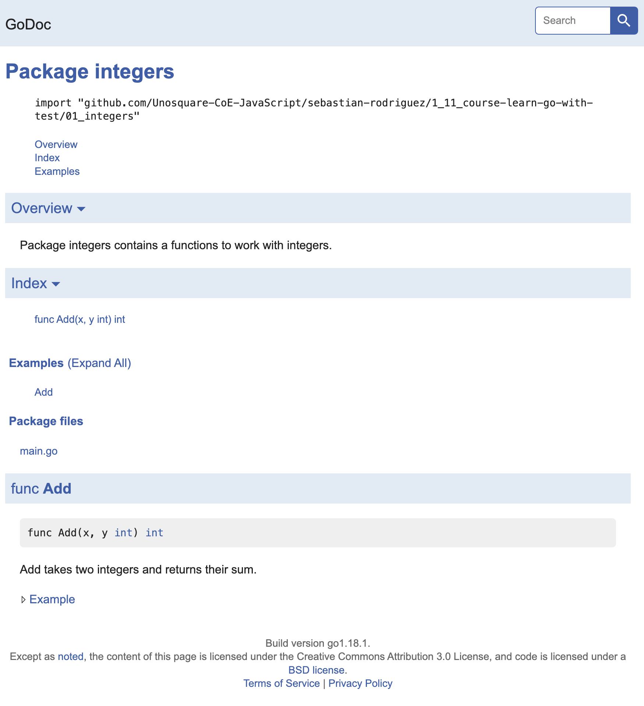

# Learn Go with Test

- [Learn Go with Test](#learn-go-with-test)
  - [Objectives](#objectives)
  - [How to test](#how-to-test)
  - [Writing test](#writing-test)
    - [if](#if)
    - [Declaring variables](#declaring-variables)
    - [t.Errorf](#terrorf)
  - [Go doc](#go-doc)
  - [Document code](#document-code)
  - [Language Features](#language-features)
    - [Constants](#constants)
    - [Switch](#switch)

## Objectives

- Explore the Go language by writing tests
- Get a grounding with TDD. Go is a good language for learning TDD because it is a simple language to learn and testing is built-in
- Be confident that you'll be able to start writing robust, well-tested systems in Go

## How to test

How do you test this? It is good to separate your "domain" code from the outside world (side-effects). For example, the **fmt.Println** is a side effect (printing to stdout) and the string we send in is our domain.

When using a statically typed language like Go it is important to listen to the compiler. The compiler understands how your code should snap together and work so you don't have to.

Let's go over the cycle again

- Write a test
- Make the compiler pass
- Run the test, see that it fails and check the error message is meaningful
- Write enough code to make the test pass
- Refactor
- 
On the face of it this may seem tedious but sticking to the feedback loop is important.

Not only does it ensure that you have relevant tests, it helps ensure you design good software by refactoring with the safety of tests.

Seeing the test fail is an important check because it also lets you see what the error message looks like. As a developer it can be very hard to work with a codebase when failing tests do not give a clear idea as to what the problem is.

By ensuring your tests are fast and setting up your tools so that running tests is simple you can get in to a state of flow when writing your code.

By not writing tests you are committing to manually checking your code by running your software which breaks your state of flow and you won't be saving yourself any time, especially in the long run.

## Writing test

Writing a test is just like writing a function, with a few rules

- It needs to be in a file with a name like xxx_test.go
- The test function must start with the word Test
- The test function takes one argument only t \*testing.T
- In order to use the \*testing.T type, you need to import "testing", like we did with fmt in the other file

For now, it's enough to know that your t of type \*testing.T is your "hook" into the testing framework so you can do things like t.Fail() when you want to fail.

We've covered some new topics:

### if

If statements in Go are very much like other programming languages.

### Declaring variables

We're declaring some variables with the syntax varName := value, which lets us re-use some values in our test for readability.

### t.Errorf

We are calling the Errorf method on our t which will print out a message and fail the test. The f stands for format which allows us to build a string with values inserted into the placeholder values %q. When you made the test fail it should be clear how it works.

## Go doc

Another quality of life feature of Go is the documentation. You can launch the docs locally by running godoc -http :8000. If you go to localhost:8000/pkg you will see all the packages installed on your system.

The vast majority of the standard library has excellent documentation with examples. Navigating to http://localhost:8000/pkg/testing/ would be worthwhile to see what's available to you.

If you don't have godoc command, then maybe you are using the newer version of Go (1.14 or later) which is no longer including godoc. You can manually install it with go install golang.org/x/tools/cmd/godoc@latest.

## The TDD process and why the steps are important

- Write a failing test and see it fail so we know we have written a relevant test for our requirements and seen that it produces an easy to understand description of the failure
- Writing the smallest amount of code to make it pass so we know we have working software
- Then refactor, backed with the safety of our tests to ensure we have well-crafted code that is easy to work with

In our case we've gone from Hello() to Hello("name"), to Hello("name", "French") in small, easy to understand steps.

This is of course trivial compared to "real world" software but the principles still stand. TDD is a skill that needs practice to develop, but by breaking problems down into smaller components that you can test, you will have a much easier time writing software.

## Document code

## Language Features

### Constants

Constants are immutable values with a specific data type.

#### What can be a constant

Any literal is a constant in Go. Some of the constants in Go would be:

- Integer: 1234
- Floating point: 23.56
- Boolean: true, false
- Rune: 0x0048
- Complex: 7+6i
- String: “Hello”

### Switch

When you have lots of if statements checking a particular value it is common to use a switch statement instead. We can use switch to refactor the code to make it easier to read and more extensible if we wish to add more language support later

